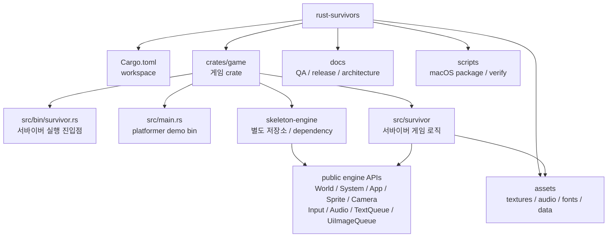
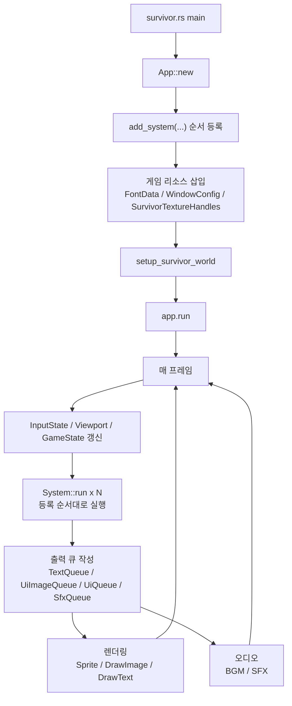
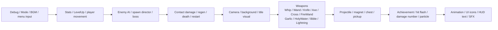
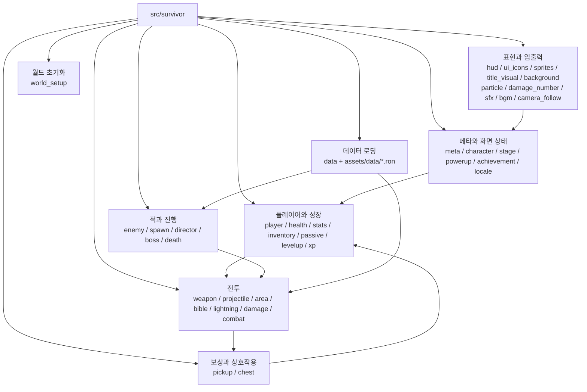
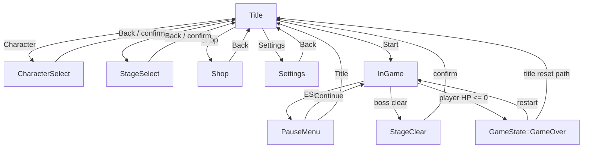
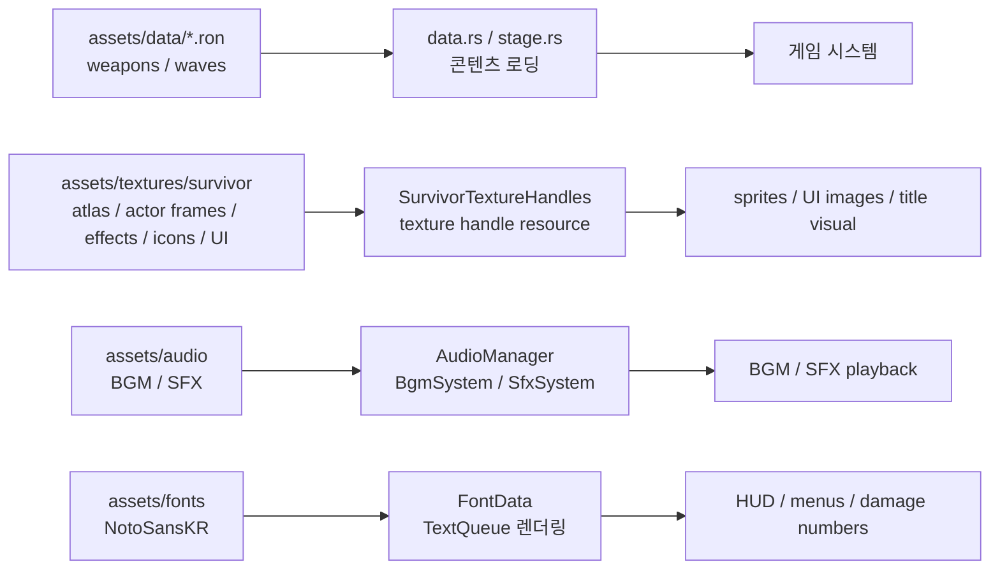

# Rust Survivors 구조도

이 문서는 새 개발자가 `rust-survivors`의 전체 경계, 실행 흐름, 게임 모듈 관계를 빠르게 잡기 위한 온보딩용 구조도다. 코드 기준 진입점은 `crates/game/src/bin/survivor.rs`이며, 실제 게임 로직은 `crates/game/src/survivor/` 아래에 있다.

## 저장소와 엔진 경계

`rust-survivors`는 게임 저장소이고, 엔진은 별도 `skeleton-engine` 저장소가 책임진다. 이 저장소에서는 엔진 내부를 직접 수정하지 않고 public API를 사용한다.

핵심 경계는 `crates/game`과 외부 엔진 dependency다. 게임 쪽에서 엔진 API 변경이 필요하면 엔진 checkout을 직접 고치지 않고 `docs/ENGINE_CHANGE_REQUESTS.md`에 요청을 남긴다. `src/main.rs`의 platformer demo binary는 유지 대상이며, 서바이버 게임 작업은 `src/bin/survivor.rs`와 `src/survivor/`가 기준이다.

## 런타임 흐름

`survivor.rs`가 앱을 만들고, 시스템을 등록하고, 폰트/창 설정/텍스처를 리소스로 넣은 뒤 `setup_survivor_world`로 초기 월드 상태를 만든다. 이후 엔진 이벤트 루프가 매 프레임 등록 순서대로 시스템을 실행한다.

시스템 등록 순서는 게임 동작의 중요한 계약이다. 메뉴와 모드 전환이 앞쪽에서 `SurvivorMode`와 `GameState`를 정리하고, 전투/성장/픽업 처리가 이어지며, HUD와 SFX 처리는 프레임 끝에서 큐를 소비하거나 화면 출력 요청을 추가한다.

## 게임 모듈 그룹

`src/survivor/mod.rs`가 하위 모듈을 선언하고 주요 타입을 재수출한다. 파일이 많기 때문에 작업할 때는 개별 파일보다 역할 그룹으로 먼저 보는 편이 빠르다.

일반적인 기능 추가는 이 흐름으로 접근한다. 새 콘텐츠 데이터는 `assets/data`와 `data.rs`를 먼저 확인하고, 플레이 중 동작은 시스템 파일을 찾고, 화면 표시가 필요하면 `hud.rs`, `ui_icons.rs`, `sprites.rs` 중 어디가 책임지는지 확인한다.

## 게임 상태 흐름

상위 화면 모드는 `SurvivorMode`가 담당하고, 실제 플레이 중 하위 상태는 엔진 `GameState`가 담당한다. 전투 시스템은 주로 `SurvivorMode::InGame`과 `GameState::Playing`일 때만 의미 있는 일을 한다.

메뉴, 상점, 선택 화면은 전투 월드와 같은 `World` 리소스를 쓰지만 모드 가드로 실행 범위를 제한한다. 그래서 UI 작업을 할 때도 먼저 현재 모드 조건을 확인해야 한다.

## 데이터와 에셋 흐름

콘텐츠 튜닝은 코드와 에셋이 함께 움직인다. RON 데이터는 무기와 웨이브 정의를 제공하고, 텍스처/오디오/폰트는 시작 시 또는 시스템 실행 중 엔진 리소스로 연결된다.

비주얼 변경은 `docs/manual_qa_checklist.md`와 패키징 검증까지 함께 고려한다. 새 에셋을 추가하면 `docs/ASSET_LICENSES.md`와 macOS package script의 포함 여부도 확인 대상이다.
