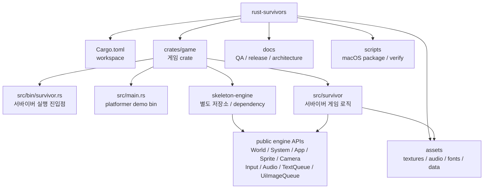
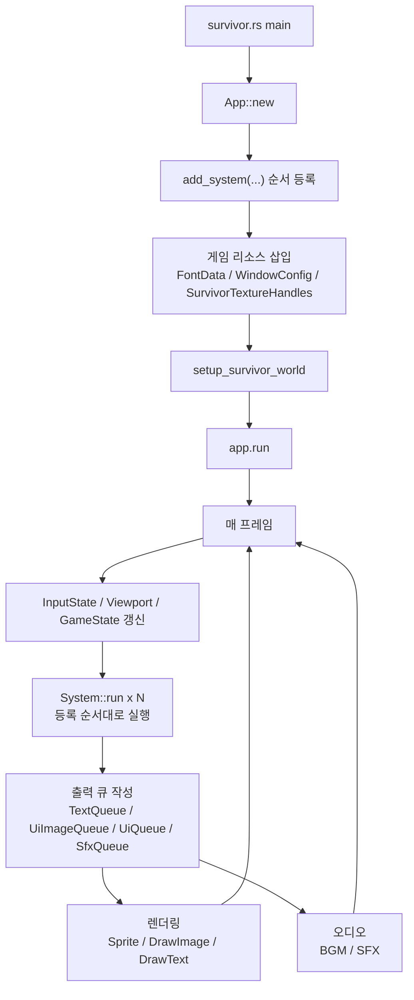
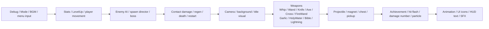
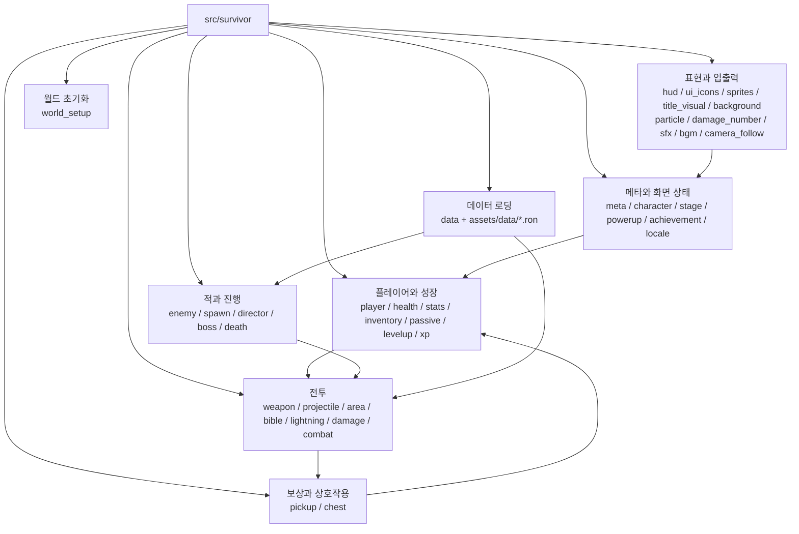
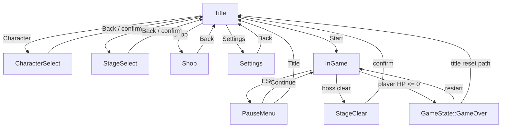
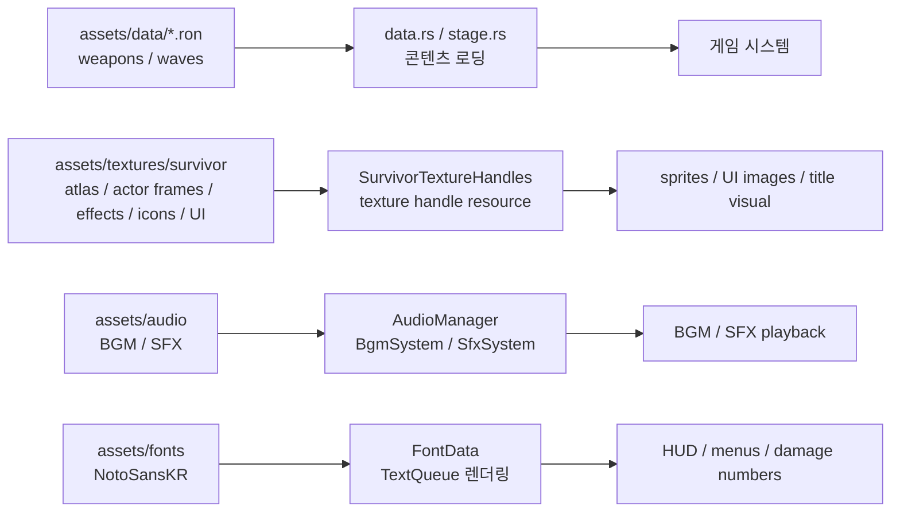

# Rust Survivors 구조도

이 문서는 새 개발자가 `rust-survivors`의 전체 경계, 실행 흐름, 게임 모듈 관계를 빠르게 잡기 위한 온보딩용 구조도다. 코드 기준 진입점은 `crates/game/src/bin/survivor.rs`이며, 실제 게임 로직은 `crates/game/src/survivor/` 아래에 있다.

## 저장소와 엔진 경계

`rust-survivors`는 게임 저장소이고, 엔진은 별도 `skeleton-engine` 저장소가 책임진다. 이 저장소에서는 엔진 내부를 직접 수정하지 않고 public API를 사용한다.

핵심 경계는 `crates/game`과 외부 엔진 dependency다. 게임 쪽에서 엔진 API 변경이 필요하면 엔진 checkout을 직접 고치지 않고 `docs/ENGINE_CHANGE_REQUESTS.md`에 요청을 남긴다. `src/main.rs`의 platformer demo binary는 유지 대상이며, 서바이버 게임 작업은 `src/bin/survivor.rs`와 `src/survivor/`가 기준이다.

## 런타임 흐름

`survivor.rs`가 앱을 만들고, 시스템을 등록하고, 폰트/창 설정/텍스처를 리소스로 넣은 뒤 `setup_survivor_world`로 초기 월드 상태를 만든다. 이후 엔진 이벤트 루프가 매 프레임 등록 순서대로 시스템을 실행한다.

시스템 등록 순서는 게임 동작의 중요한 계약이다. 메뉴와 모드 전환이 앞쪽에서 `SurvivorMode`와 `GameState`를 정리하고, 전투/성장/픽업 처리가 이어지며, HUD와 SFX 처리는 프레임 끝에서 큐를 소비하거나 화면 출력 요청을 추가한다.

## 게임 모듈 그룹

`src/survivor/mod.rs`가 하위 모듈을 선언하고 주요 타입을 재수출한다. 파일이 많기 때문에 작업할 때는 개별 파일보다 역할 그룹으로 먼저 보는 편이 빠르다.

일반적인 기능 추가는 이 흐름으로 접근한다. 새 콘텐츠 데이터는 `assets/data`와 `data.rs`를 먼저 확인하고, 플레이 중 동작은 시스템 파일을 찾고, 화면 표시가 필요하면 `hud.rs`, `ui_icons.rs`, `sprites.rs` 중 어디가 책임지는지 확인한다.

## 게임 상태 흐름

상위 화면 모드는 `SurvivorMode`가 담당하고, 실제 플레이 중 하위 상태는 엔진 `GameState`가 담당한다. 전투 시스템은 주로 `SurvivorMode::InGame`과 `GameState::Playing`일 때만 의미 있는 일을 한다.

메뉴, 상점, 선택 화면은 전투 월드와 같은 `World` 리소스를 쓰지만 모드 가드로 실행 범위를 제한한다. 그래서 UI 작업을 할 때도 먼저 현재 모드 조건을 확인해야 한다.

### 상태 참조표

| 구분 | 상태 | 의미 | 주요 진입 | 주요 이탈/처리 |
|---|---|---|---|---|
| `SurvivorMode` | `Title` | 시작 화면과 메인 메뉴 | 최초 `setup_survivor_world`, 타이틀 복귀 | Start는 `InGame`, 메뉴 항목은 선택/상점/설정 화면으로 이동 |
| `SurvivorMode` | `CharacterSelect` | 캐릭터 선택 화면 | Title에서 Character 선택 | 확정 또는 취소 후 `Title` |
| `SurvivorMode` | `StageSelect` | 스테이지 선택 화면 | Title에서 Stage 선택 | 해금 검증 후 선택하거나 취소하면 `Title` |
| `SurvivorMode` | `Shop` | 메타 파워업 상점 | Title에서 Shop 선택 | 구매 처리 후 유지, 뒤로 가면 `Title` |
| `SurvivorMode` | `Settings` | 해상도, 언어, HUD, 볼륨 설정 | Title에서 Settings 선택 | 설정 저장 후 뒤로 가면 `Title` |
| `SurvivorMode` | `InGame` | 실제 플레이 모드 | Title Start, 재시작, 일시정지 해제 | ESC는 `PauseMenu`, 보스 클리어는 `StageClear`, 사망은 `GameState::GameOver` |
| `SurvivorMode` | `PauseMenu` | 인게임 일시정지 메뉴 | `InGame` 중 ESC | Continue는 `InGame`, Title 선택은 `Title` |
| `SurvivorMode` | `StageClear` | 스테이지 클리어 결과 화면 | 보스 사망과 클리어 조건 달성 | 확인 입력 후 `Title` |
| `GameState` | `Playing` | 전투 시스템이 정상 실행되는 상태 | 게임 시작, 재시작, 일시정지 해제, 레벨업 선택 완료 | 레벨업, 메뉴, 사망 조건에서 다른 상태로 전환 |
| `GameState` | `Paused` | 전투 업데이트를 멈추고 UI/메뉴를 보여주는 상태 | Title/Shop/Settings 같은 비전투 모드, PauseMenu, LevelUp | 모드 전환 또는 선택 완료 시 `Playing` |
| `GameState` | `GameOver` | 플레이어 사망 결과 상태 | `Health`가 0 이하가 되면 `DeathSystem`이 설정 | Restart 입력은 새 플레이, 타이틀 복귀 경로는 `Title` |
| 조합 상태 | Level-up card | 별도 `SurvivorMode`가 아니라 `InGame` + `GameState::Paused` + `PendingLevelUp` | XP 임계치 도달 | `1/2/3` 카드 선택 후 `GameState::Playing` |

## 데이터와 에셋 흐름

콘텐츠 튜닝은 코드와 에셋이 함께 움직인다. RON 데이터는 무기와 웨이브 정의를 제공하고, 텍스처/오디오/폰트는 시작 시 또는 시스템 실행 중 엔진 리소스로 연결된다.

비주얼 변경은 `docs/manual_qa_checklist.md`와 패키징 검증까지 함께 고려한다. 새 에셋을 추가하면 `docs/ASSET_LICENSES.md`와 macOS package script의 포함 여부도 확인 대상이다.

### 에셋 참조표

| 분류 | 파일 | 용도 | 대표 사용처 |
|---|---|---|---|
| 데이터 | `assets/data/weapons.ron` | 기본 무기 스탯과 무기별 파라미터 | `data.rs`, `inventory.rs` |
| 데이터 | `assets/data/waves.ron` | 기본 웨이브 정의 | `director.rs`의 기본 `SpawnDirector` 로딩 |
| 데이터 | `assets/data/waves_mad_forest.ron` | Mad Forest 스테이지 웨이브 | `stage.rs` |
| 데이터 | `assets/data/waves_inlaid_library.ron` | Inlaid Library 스테이지 웨이브 | `stage.rs` |
| 데이터 | `assets/data/waves_dairy_plant.ron` | Dairy Plant 스테이지 웨이브 | `stage.rs` |
| 폰트 | `assets/fonts/NotoSansKR-Regular.ttf` | 한국어/영어 UI 텍스트 렌더링 | `survivor.rs`에서 `FontData`로 삽입 |
| 폰트 라이선스 | `assets/fonts/OFL.txt` | Noto Sans KR 라이선스 | 배포/라이선스 문서 참고 |
| 셰이더 | `assets/shaders/sprite.wgsl` | 스프라이트 렌더링 셰이더 | 엔진 렌더러 경로 |
| BGM | `assets/audio/rustsurvivors title1.mp3`, `rustsurvivors title2.mp3` | 타이틀, 선택 화면, 상점, 설정, 일시정지 BGM playlist | `BgmSystem` |
| BGM | `assets/audio/rustsurvivors ingame1.mp3`, `rustsurvivors ingame2.mp3` | 일반 인게임 BGM playlist | `BgmSystem` |
| BGM | `assets/audio/rustsurvivors boss1.mp3`, `rustsurvivors boss2.mp3` | 보스 활성 중 인게임 BGM playlist | `BgmSystem` |
| BGM | `assets/audio/rustsurvivors stageclear1.mp3`, `rustsurvivors stageclear2.mp3` | 스테이지 클리어 1회 cue | `BgmSystem` |
| BGM | `assets/audio/rustsurvivors gameover1.mp3`, `rustsurvivors gameover2.mp3` | 게임오버 1회 cue | `BgmSystem` |
| SFX | `assets/audio/sfx_enemy_hit.wav` | 적 피격 효과음 | `SfxEvent::EnemyHit` |
| SFX | `assets/audio/sfx_enemy_die.wav` | 적 사망 효과음 | `SfxEvent::EnemyDie` |
| SFX | `assets/audio/sfx_player_hit.wav` | 플레이어 피격 효과음 | `SfxEvent::PlayerHit` |
| SFX | `assets/audio/sfx_levelup.wav` | 레벨업 효과음 | `SfxEvent::LevelUp` |
| SFX | `assets/audio/sfx_xp.wav` | XP 젬 획득 효과음 | `SfxEvent::XpGem` |
| SFX | `assets/audio/sfx_pickup.wav` | 일반 픽업 효과음 | `SfxEvent::Pickup` |
| SFX | `assets/audio/sfx_bomb.wav` | Bomb 픽업 폭발 효과음 | `SfxEvent::Bomb` |
| SFX | `assets/audio/sfx_chest_open.wav` | 보물상자 오픈 효과음 | `SfxEvent::ChestOpen` |
| SFX | `assets/audio/sfx_boss_appear.wav` | 보스 등장 효과음 | `SfxEvent::BossAppear` |
| 텍스처 | `assets/textures/survivor/survivor_atlas.png` | 기본 캐릭터/적/픽업/투사체 atlas | `SurvivorTextureHandles`, `sprites.rs` |
| 텍스처 | `assets/textures/survivor/survivor_actor_frames.png` | 플레이어/적 actor 애니메이션 프레임 | `AnimationPlayer`, `AnimationSystem` |
| 텍스처 | `assets/textures/survivor/survivor_effects.png` | 무기와 전투 이펙트 sheet | `sprites.rs`, 무기 시스템 |
| 텍스처 | `assets/textures/survivor/survivor_icons.png` | HUD, 레벨업 카드, 상점용 아이콘 | `icons.rs`, `ui_icons.rs` |
| 텍스처 | `assets/textures/survivor/survivor_evolutions.png` | 진화 무기 아이콘 sheet | `sprites.rs`, UI 표시 경로 |
| 텍스처 | `assets/textures/survivor/survivor_passives.png` | 패시브 아이템 아이콘 sheet | `sprites.rs`, UI 표시 경로 |
| 텍스처 | `assets/textures/survivor/survivor_powerups.png` | 메타 파워업 아이콘 sheet | `sprites.rs`, 상점 UI |
| 타이틀 UI | `assets/textures/survivor/menu/title_backdrop_v2.png` | 현재 타이틀 배경 | `TitleVisualSystem` |
| 타이틀 UI | `assets/textures/survivor/menu/title_logo_plaque_v3.png` | 타이틀 로고 받침 이미지 | `TitleVisualSystem` |
| 타이틀 UI | `assets/textures/survivor/menu/menu_button_start_{ko,en}.png` | Start 버튼 이미지 | `TitleVisualSystem` |
| 타이틀 UI | `assets/textures/survivor/menu/menu_button_character_{ko,en}.png` | Character 버튼 이미지 | `TitleVisualSystem` |
| 타이틀 UI | `assets/textures/survivor/menu/menu_button_stage_{ko,en}.png` | Stage 버튼 이미지 | `TitleVisualSystem` |
| 타이틀 UI | `assets/textures/survivor/menu/menu_button_shop_{ko,en}.png` | Shop 버튼 이미지 | `TitleVisualSystem` |
| 타이틀 UI | `assets/textures/survivor/menu/menu_button_settings_{ko,en}.png` | Settings 버튼 이미지 | `TitleVisualSystem` |
| 공통 UI | `assets/textures/survivor/ui/ui_modal_panel.png` | 모달/메뉴/결과 패널 프레임 | `hud.rs`, `ui_icons.rs` |
| 공통 UI | `assets/textures/survivor/ui/ui_slot_frame.png` | HUD 슬롯, 카드, 선택 행 프레임 | `hud.rs`, `ui_icons.rs` |
